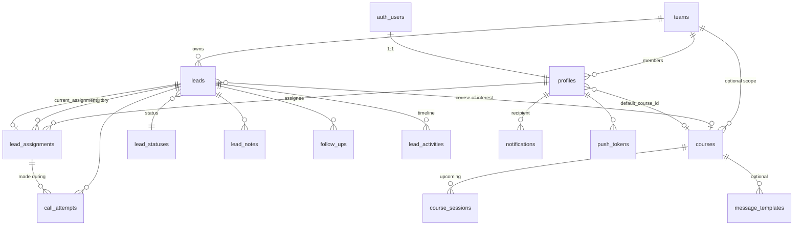

# Setu — Architecture

Status: Phase 1 (foundation) implemented. This document is the source of truth for
design decisions; update it when a decision changes.

---

## 1. Final architecture

```
┌──────────────────────┐     ┌──────────────────────┐
│ apps/web (Next.js)   │     │ apps/mobile (Expo)   │
│ admin/teacher/vol UI │     │ volunteer-first UI   │
└─────────┬────────────┘     └──────────┬───────────┘
          │  supabase-js (anon key + user JWT only)
          ▼                             ▼
┌───────────────────────────────────────────────────────┐
│ Supabase                                              │
│  Auth ─ JWT ─► PostgREST ─► Postgres (RLS everywhere) │
│                    │          ├─ tables               │
│                    │          ├─ RPC functions        │  ◄── all business rules
│                    │          │  (assign, log call,   │      (assignment, deadlines,
│                    │          │   reassign, merge…)   │       reassignment, DNC)
│                    │          ├─ triggers (history,   │
│                    │          │   activity, counters) │
│                    │          └─ pg_cron jobs         │
│  Realtime (postgres_changes, RLS-filtered)            │
│  Edge Functions (service role, never shipped to UI):  │
│    admin-users  (create/invite/deactivate accounts)   │
│    dispatch-push (Expo push for notification rows)    │
│  Storage: course-posters bucket                       │
└───────────────────────────────────────────────────────┘
```

Key decisions

| Decision | Reason |
|---|---|
| **Business rules live in Postgres** (SECURITY DEFINER RPCs + triggers) | One implementation shared by web, mobile, cron and future webhooks; transactional; cannot be bypassed by a modified client. |
| **Edge Functions only where the service role is unavoidable** | Creating auth users and sending push notifications need secrets; everything else stays in SQL. |
| **pg_cron runs `process_overdue_assignments()` every 5 minutes** | Server clock, no extra infrastructure. Worst-case latency after a deadline is ~5 min. |
| **Volunteers have no direct UPDATE on `leads`** | They change leads only through RPCs (`log_call_attempt`, `update_lead_status`, `schedule_follow_up`), which validate state and write history. |
| **Column-level grants + RLS** | Staff can edit lead content directly, but system columns (`assigned_to`, counters, deadlines) are never writable from a client. |
| **npm workspaces monorepo** | npm is already installed; no extra tooling needed. Turborepo can be added later if builds get slow. |
| **Shared TS package consumed as source** | Next.js (`transpilePackages`) and Metro both compile it; no build step to forget. |

## 2. Entity relationship design



| Table | Purpose / notes |
|---|---|
| `teams` | Organisational group / location. Every teacher & volunteer and every lead belongs to one team. |
| `profiles` | 1:1 with `auth.users`. Role (`super_admin`/`teacher`/`volunteer`), status, team, availability (`accepting_leads`), workload cap, default course. No passwords (Supabase Auth owns them). |
| `org_settings` | Singleton: contact deadline hours (default 24), auto-reassign on/off, max auto reassignments per lead, default workload cap, default timezone & phone country, branding. |
| `lead_statuses` | Configurable status list with `is_closed` (no reassignment/follow-up expected) and `blocks_contact` (Do Not Contact). |
| `leads` | Contact + meeting info, course of interest, **current** status/assignee (denormalised for fast filtering), counters maintained by triggers. Soft archive + `merged_into_id`. |
| `lead_assignments` | Append-only assignment history. One open row per lead (partial unique index). Holds `contact_deadline_at` and `first_contact_at`. Core columns are immutable (trigger). |
| `call_attempts` | Qualifying contact attempts with outcome, server timestamp, linked to the assignment they were made under. `source`/`provider_call_id` reserved for telephony webhooks. |
| `lead_notes`, `follow_ups` | Notes (immutable) and follow-up reminders. |
| `lead_activities` | Timeline written exclusively by triggers/RPCs. |
| `courses`, `course_sessions` | Course catalogue and dated sessions (start/end timestamps, mode, venue, links, poster). |
| `message_templates` | Approved WhatsApp templates with placeholders. |
| `notifications`, `push_tokens` | In-app notifications (also the push outbox). |
| `audit_logs` | Assignments, reassignment, role/status changes, merges, exports, settings changes. |

Status, call outcome and assignment are three independent dimensions:
`leads.status` (configurable), `call_attempts.outcome` (enum), `lead_assignments` (history).

## 3. Role & permission matrix

Enforced in the database. UI hiding is cosmetic only.

| Capability | Super Admin | Teacher (own team) | Volunteer |
|---|---|---|---|
| Create/deactivate users | all | volunteers in own team | – |
| Change roles / team | ✔ | – | – |
| View leads | all | team | **only currently assigned** |
| Create / edit lead details | ✔ | team | – (status/notes via RPC) |
| Assign / bulk assign / unassign | ✔ | team → team volunteers | – |
| Log call attempt, notes, follow-ups | ✔ | team | assigned leads |
| Change lead status | ✔ | team | assigned leads (via RPC) |
| Merge duplicates / import / export | ✔ | team | – |
| Courses & sessions | all | create; edit own/team | read |
| Message templates | all | team | read |
| Reports | org | team | own activity |
| Settings, statuses, reassignment rules | ✔ | – | – |
| Audit log | ✔ | – | – |
| Own profile (name, phone, default course, availability) | ✔ | ✔ | ✔ |

Volunteers can see the history (calls, notes, assignment timeline) of a lead **while it is assigned to them**,
so a reassigned volunteer has context. Other volunteers' names appear only if visible to them (staff).
Inactive users get no data even with a still-valid JWT (`private.my_role()` returns NULL).

## 4. Assignment & reassignment workflow

```
            assign_leads(ids[], volunteer)            ┌─────────────────────┐
 New lead ───────────────────────────────────────────►│ assignment OPEN     │
                (locks rows, ends previous            │ deadline = now()+Nh │
                 assignment, notifies)                └─────────┬───────────┘
                                                                │
          log_call_attempt (any outcome) ──► first_contact_at set ─► never auto-reassigned
                                                                │ no attempt by deadline
                                                                ▼
                         cron: process_overdue_assignments()  (every 5 min)
                         advisory lock + FOR UPDATE SKIP LOCKED
                                                                │
                 ┌───────────────── candidate found? ───────────┴─────────────┐
                 ▼ yes                                                        ▼ no (or cap reached)
  end old (reassigned_auto), open new with                   end old (auto_no_candidate),
  fresh deadline, notify old + new + team staff              lead.assigned_to = NULL,
                                                             needs_attention = true, alert staff
```

Candidate rules: active volunteer, `accepting_leads`, same team as lead, not the current
assignee, under workload cap. Ordering: fewest prior holds of this lead → fewest open
assignments → least recently assigned. After `max_auto_reassignments` (default 3) a lead
goes to the attention queue instead of cycling forever.

Qualifying contact = a `call_attempts` row (any outcome) recorded during the current
assignment. Opening the lead, tapping call or WhatsApp do **not** count. Closed statuses
(Registered, Not Interested, DNC, …) are never auto-reassigned.

Concurrency: a transaction-scoped advisory lock means only one job instance runs at a time;
rows are locked `FOR UPDATE SKIP LOCKED`; manual assignment locks the same rows; a partial
unique index guarantees at most one open assignment per lead even if all else failed.

## 5. Navigation

Web sidebar (filtered by role): Dashboard · Leads · Volunteers · Users (super admin) ·
Courses · Upcoming · Reports · Notifications · Settings (super admin).
Volunteers on web see: Dashboard · My Leads · Upcoming · Notifications · Profile.

Mobile bottom tabs: Home · My Leads · Upcoming · Notifications · Profile. The lead row
and lead detail show Call / WhatsApp / Log outcome / Follow-up as primary actions.
After tapping Call, returning to the app opens the "Record outcome" sheet.

## 6. Folder structure

```
apps/web               Next.js (App Router) + Tailwind + shadcn/ui     [Phase 2]
apps/mobile            Expo (React Native)                              [Phase 6]
packages/shared        types, zod schemas, phone/WhatsApp/template utils
packages/db-tests      PGlite-based tests that run the real migrations
supabase/config.toml   Supabase CLI config (signups disabled)
supabase/migrations    schema, RLS, functions, cron
supabase/functions     Edge Functions (admin-users, dispatch-push)      [Phase 2/6]
supabase/seed.sql      local dev seed
docs/                  architecture, setup, decisions, deployment
```

## 7. Milestones & testing strategy

| Phase | Deliverable | Gate |
|---|---|---|
| 1 | Schema, RLS, RPCs, reassignment job, shared package | DB tests (PGlite) + shared unit tests green |
| 2 | Web: auth, dashboards, leads list/detail, bulk assign, user admin edge function | Typecheck, component tests, manual run against Supabase project |
| 3 | Courses, sessions, list + calendar | DB tests for expiry; UI tests |
| 4 | Call/WhatsApp flow, outcome logging, follow-ups, timeline | Shared util tests; e2e (Playwright) on web |
| 5 | Cron enablement, admin alerts, reassignment reports | Reassignment tests (done in Phase 1) + concurrency test against real Postgres |
| 6 | Expo app, push notifications | Expo dev build on Android/iOS |
| 7 | Reports, monitoring, deployment docs | Full workflow A–D checklist |

Test layers:
1. **Database (most important)** — `packages/db-tests`: runs every migration in PGlite with a
   Supabase `auth` shim, then exercises RLS as each role, assignment, reassignment, DNC, etc.
   A separate concurrency test runs only when `DATABASE_URL` points at a real Postgres
   (PGlite has a single connection and cannot test true parallelism).
2. **Shared logic** — vitest unit tests (phone normalisation, WhatsApp links, templates).
3. **UI** — component tests + Playwright e2e for web; manual device checks for mobile.

## 8. Limitations & external requirements

| Item | Requirement / cost |
|---|---|
| Supabase project | Free tier is enough for development. **Production should use Pro (~$25/mo)**: free projects pause after inactivity (which stops cron) and have no daily backups. |
| pg_cron | Available on all Supabase plans; enabled by migration. |
| Local Supabase stack | Needs Docker Desktop (not installed on this machine). Not required — a hosted project works. |
| Push notifications | Expo push service (free). iOS needs an **Apple Developer account ($99/yr)**; Android needs a Firebase project (free) for FCM credentials. |
| App store publishing | Apple $99/yr, Google Play $25 one-time. EAS Build free tier is enough to start. |
| Calls | `tel:` links open the dialer; the CRM **cannot verify** a call happened. Volunteers record outcomes. Telephony verification (Exotel/Twilio webhooks) is a future paid integration; `call_attempts.source/provider_call_id` are ready for it. |
| WhatsApp | `https://wa.me/<number>?text=` prefill only; the volunteer presses send. No automated/bulk sending (that would need the WhatsApp Business API, opt-in consent and per-message fees). |
| Email (password reset/invites) | Supabase's built-in SMTP is rate-limited (a few emails/hour). Production needs a custom SMTP provider (e.g. Resend/SendGrid free tiers). |
| Branding | No official logos are bundled; org name/colours/logo are configurable in `org_settings.branding`. |
